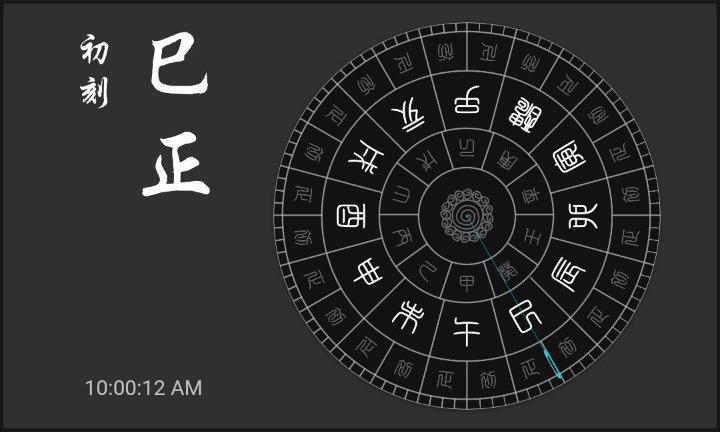

# Flutter Clock

The [Analog Clock](analog_clock) implementation is inspired by the ancient chinese timing device: [Sundial](https://en.wikipedia.org/wiki/Sundial).

- :point_right: [Flutter Web demo](https://xinthink.github.io/flutter_clock)
- :point_right: [Detailed documentation](analog_clock/README.md)

Tranditional Chinese fonts used in this implementation:
- [白舟太篆书体粗](http://www.fonts.net.cn/font-33216292055.html)
- [腾祥伯当行楷繁](http://www.fonts.net.cn/font-33203372624.html)

***
See [flutter.dev/clock](https://flutter.dev/clock) for how to get started, submission requirements, contest rules, and FAQs.

See a [live demo](https://maryx.github.io/flutter_clock) with Flutter for Web!

Example [Digital Clock](digital_clock)

