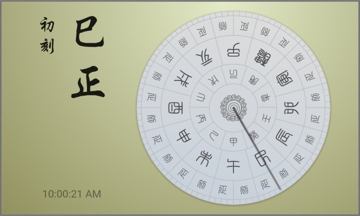
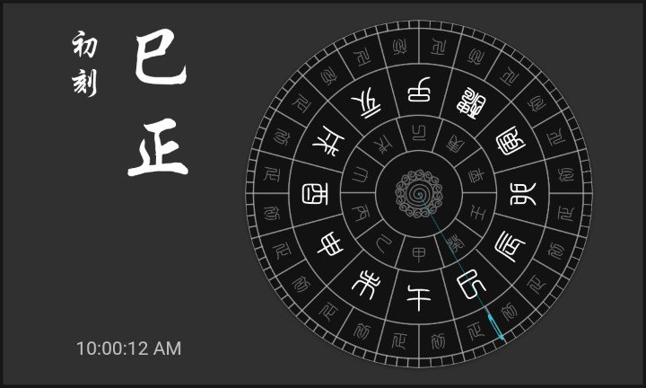
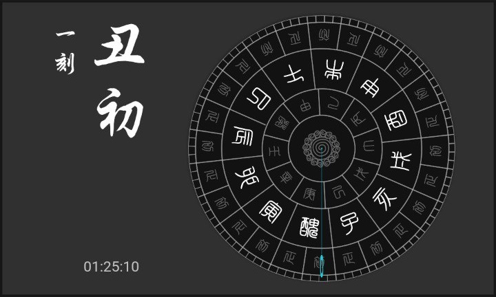
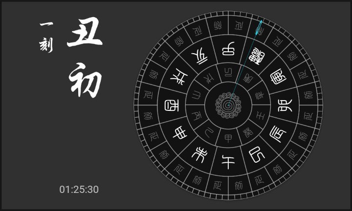
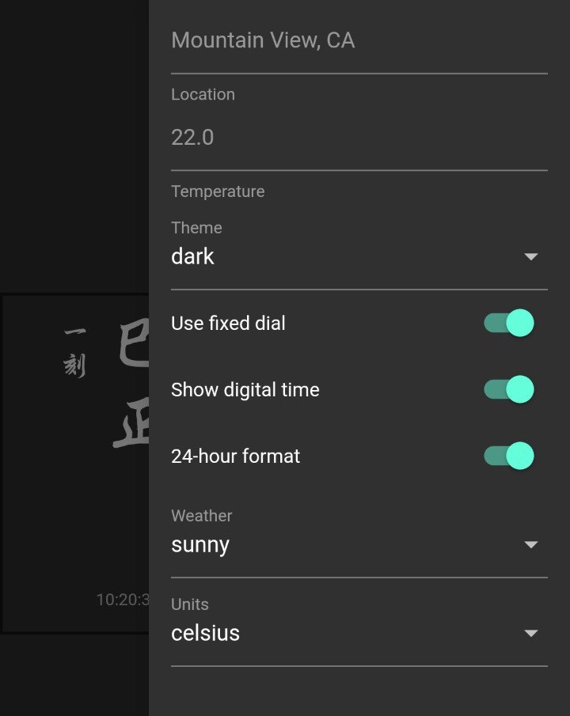

# Analog Clock - the sundial implementation

An analog clock implementation inspired by the ancient chinese timing device: [Sundial].

## Sundial

The definition on [Wikipedia][Sundial]:
> A sundial is a device that tells the time of day when there is sunlight by the apparent position of the Sun in the sky. In the narrowest sense of the word, it consists of a flat plate (the dial) and a [gnomon], which casts a shadow onto the dial. As the Sun appears to move across the sky, the shadow aligns with different hour-lines, which are marked on the dial to indicate the time of day.

Sundials in real world:

### Ancient Chinese time symbols

Ancient chinese people divide a day into 12 periods, each for 2 hours, and name them with the twelve [Earthly Branches].

|Earthly Branch|Double Hour|
|---|---|
|子|11pm to 1am (midnight)|
|丑|1am to 3am|
|寅|3am to 5am|
|卯|5am to 7am|
|辰|7am to 9am|
|巳|9am to 11am|
|午|11am to 1pm (noon)|
|未|1pm to 3pm|
|申|3pm to 5pm|
|酉|5pm to 7pm|
|戌|7pm to 9pm|
|亥|9pm to 11pm|

In addition, for each of the periods, the first and the second hour is named **初** and **正** respectively. For example, **午** which represents **noon** (11am to 1pm), is divided into **午初** and **午正**, representing the time from `11am` to `12pm`, and `12pm` to `1pm`, respectively.

To indicate the time more precisely, ancient chinese people introduced **刻** (quarters) to represent every 15 minutes, so that there are 4 quarters per hour, and 96 quarters per day.

|Quarter|Minutes|
|---|---|
|初刻|0' to 15' (the first quarter)|
|一刻|15' to 30' (the second quarter)|
|二刻|30' to 45' (the third quarter)|
|三刻|45' to 60' (the fourth quarter)|

Putting them together, an ancient chinese [sundial] divides a day into 96 periods, with a minimum unit of one quarter (15 minutes). Examples are listed below:

|Time|In Ancient Chinese|
|---|---|
|00:05 AM|子正初刻|
|00:45 AM|子正三刻|
|07:00 AM|辰初初刻|
|11:30 AM|午初二刻|
|12:50 PM|午正三刻|
|09:00 PM|亥初初刻|
|11:50 PM|子初三刻|

See the [test cases][hours tests] for details.

## The Implementation

A real [sundial] indicates time with the shadow of the [gnomon], but in this simplified simulation implementation, the following facts are ignored:
- A [sundial] only works under sunlight, which means it doesn't work at night
- I make the dial rotates during the day, instead of the shadow of the [gnomon], so that we can read the marks on the dial much easier, but it's configurable in the customizer screen

### Reading the time

In the **rotated-dial** mode (the default), the current time pointer always points to the bottom center of the dial. While in the **fixed-dial** mode, the pointer (shadow of the [gnomon]) travels across the dial during the day. For example, the following screenshots represent the **rotated-dial** and the **fixed-dial** mode respectively, both of them indicate a same time: `01:25 AM`.

<table>
  <tr>
    <td></td>
    <td></td>
  </tr>
</table>

In either mode, the dial or the pointer travels 360° (a whole circle) every 24 hours, so you may hardly realize the movement even if you stare at the screen for a while. :smile:

### Customizable Options

Two options are added to the Customizer screen:
- Switch of the **fixed-dial** mode, in which the shadow of the [gnomon] travels across a fixed dial to indicate the time of day, `disabled` by default
- Whether or not to display a **digital time** at the bottom of the screen, `enabled` by default

### Fonts

Tranditional Chinese fonts used in this app:
- [白舟太篆书体粗](http://www.fonts.net.cn/font-33216292055.html)
- [腾祥伯当行楷繁](http://www.fonts.net.cn/font-33203372624.html)

[Sundial]: https://en.wikipedia.org/wiki/Sundial
[Gnomon]: https://en.wikipedia.org/wiki/Gnomon
[Earthly Branches]: https://en.wikipedia.org/wiki/Earthly_Branches
[hours tests]: test/traditional_time_util_test.dart
