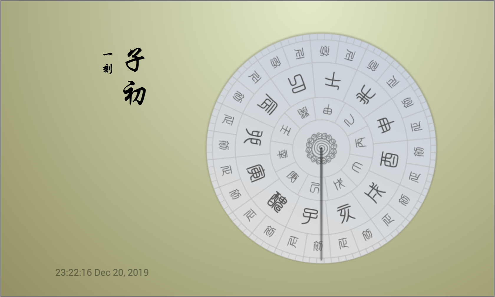

# Analog Clock

An analog clock implementation inspired by the ancient chinese timing device: [Sundial](https://en.wikipedia.org/wiki/Sundial).

Tranditional Chinese fonts used in this app:
- [白舟太篆书体粗](http://www.fonts.net.cn/font-33216292055.html)
- [腾祥伯当行楷繁](http://www.fonts.net.cn/font-33203372624.html)
